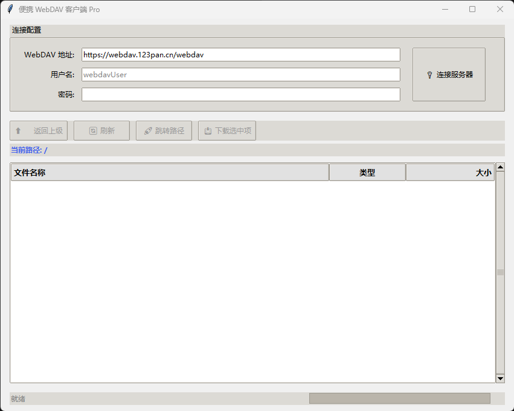

# 🚀 Portable WebDAV Client (便携 WebDAV 客户端)



一个基于 Python 和 Tkinter 开发的轻量级、便携式 WebDAV 客户端。支持快速连接 WebDAV 服务器（如 123云盘、坚果云、Alist等），提供直观的可视化界面进行文件浏览与下载。

## ✨ 核心特性

- **🧳 绿色免安装**：提供打包好的单文件 `.exe` 可执行程序，不写注册表、不留系统垃圾，放进 U 盘插上就能用。
- **🎈 极致轻量**：纯 Python 编写，运行资源占用极低，哪怕是十年前的老电脑也能流畅运行。
- **🖥️ 现代 UI**：采用 `ttk` 扁平化主题，支持 Treeview 多列文件列表及 Emoji 图标指示。
- **🖱️ 便捷交互**：
  - 支持双击进入文件夹 / 提示并下载文件。
  - 支持右键快捷菜单（快速下载、复制文件名）。
  - 支持路径历史记录与上级返回。
  - 支持绝对路径一键跳转。
- **📥 智能下载**：内置异步下载引擎，实时显示下载进度条与动态网速 (KB/s, MB/s)。
- **🔒 隐私安全**：账号密码仅在内存中流转，不生成任何本地配置文件，用完即关，绝对安全。

## 📦 如何使用 (普通用户)

如果你不想配置 Python 环境，可以直接下载打包好的便携版可执行文件：
1. 前往本项目的 [Releases 页面](https://github.com/jiu-zui-90817/Portable-WebDAV-Client/releases)。
2. 下载最新的 `可执行` 文件。
3. 双击直接运行，无需安装！

## 🛠️ 如何开发/运行源代码 (开发者)

如果你想自行修改代码或在 Mac/Linux 上运行，请按照以下步骤操作：

**1. 克隆项目**
```bash
git clone https://github.com/jiu-zui-90817/Portable-WebDAV-Client.git

cd Portable-WebDAV-Client


